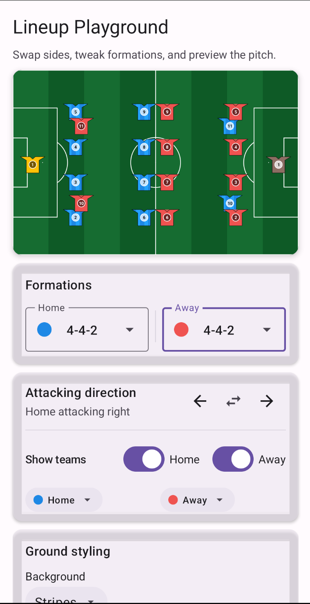

# Compose Football Pitch (Compose Multiplatform) 🏟️

[](https://github.com/IbrahimAlzaidi/ComposeFootballPitch/actions/workflows/build.yml)
[](https://github.com/IbrahimAlzaidi/ComposeFootballPitch/actions/workflows/code_style.yml)
[](LICENSE.txt)
[](https://kotlinlang.org)
[](https://www.jetbrains.com/lp/compose-multiplatform/)

A Compose Multiplatform library for rendering customizable football (soccer) pitches and team lineups across Android, Desktop, and iOS. Comes with a playground app for experimenting with formations, grass styles, and kit colors.

## Preview ⚽


## Highlights ✨
- ⚽ Accurate pitch markings based on FIFA guidance with configurable colors and thickness.
- 🔄 Four orientations (horizontal or vertical, normal or reversed) plus mirrored attack directions for away teams.
- 🌱 Grass backgrounds: solid, stripes, checkerboard, and gradients with custom palettes.
- 🧢 Formation-aware lineups with simple shirt styles for field players and goalkeepers.
- 📱 Pure Compose API shared across Android, Desktop, and iOS targets.

## Installation 📦
Add the dependency once published (or depend on the included module while working in this repo):

```kotlin
repositories {
    mavenCentral()
}
dependencies {
    implementation("io.github.ibrahimalzaidi:compose-football-pitch:0.1.0")
    // or, when working locally:
    // implementation(project(":ComposeFootballPitch"))
}
```

## Quick start 🚀

```kotlin
import androidx.compose.runtime.Composable
import androidx.compose.ui.graphics.Color
import footballpitch.FootballPitch
import footballpitch.model.*

@Composable
fun MatchScreen() {
    val matchTeams = MatchTeams(
        home = TeamSetup(
            name = "Home",
            colorArgb = 0xFF1E88E5,
            goalkeeperColorArgb = 0xFFFFC107,
            formation = Formations.fourFourTwo(),
            kitStyle = TeamKitStyle(
                fieldPlayerShirtStyle = ShirtStyle.STRIPED,
                goalkeeperShirtStyle = ShirtStyle.GOALKEEPER,
            ),
        ),
        away = TeamSetup(
            name = "Away",
            colorArgb = 0xFFEF5350,
            goalkeeperColorArgb = 0xFF8D6E63,
            formation = Formations.threeFourThree(),
            kitStyle = TeamKitStyle(
                fieldPlayerShirtStyle = ShirtStyle.COLLAR,
                goalkeeperShirtStyle = ShirtStyle.GOALKEEPER,
            ),
        ),
    )
    val (homeLineup, awayLineup) = matchTeams.toLineups()

    FootballPitch(
        orientation = PitchOrientation.Horizontal,
        style = PitchStyle(
            background = PitchBackground.Gradient(
                colors = listOf(Color(0xFF166C31), Color(0xFF0E5A26)),
            ),
        ),
        homeTeam = homeLineup,
        awayTeam = awayLineup,
    )
}
```

## Module layout 🗂️
- `ComposeFootballPitch` - the KMP library.
- `sample/shared` - shared Compose code for the sample apps.
- `sample/androidApp` - Android playground wired to the latest UI.
- `sample/desktopApp` and `sample/iosApp` - platform shells (wire as needed for your setup).

## Run the samples ▶️
- Android: `./gradlew :sample:androidApp:assembleDebug`
- Desktop: `./gradlew :sample:desktopApp:run`

## Development 🛠️
- Library sources: `ComposeFootballPitch/src/commonMain/kotlin/footballpitch`
- Rendering internals: `ComposeFootballPitch/src/commonMain/kotlin/footballpitch/rendering`
- Tests: `ComposeFootballPitch/src/commonTest`

Useful tasks:

```bash
./gradlew :ComposeFootballPitch:check
./gradlew ktlintCheck
```

## Publishing notes 📣
Gradle coordinates are set to `io.github.ibrahimalzaidi:compose-football-pitch:0.1.0`. Update them to match your Sonatype group before release.

## License 📄
Apache 2.0. See `LICENSE.txt`.
