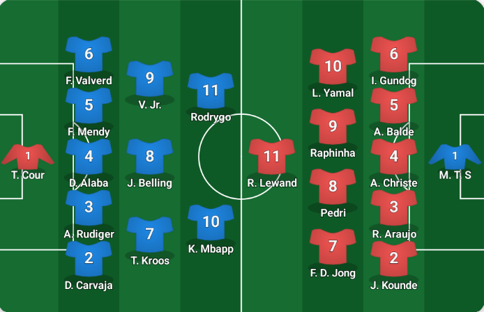
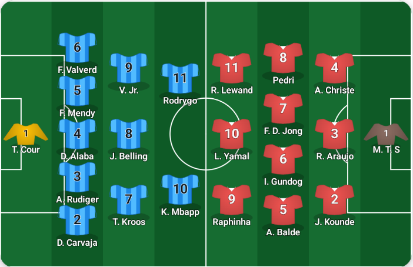
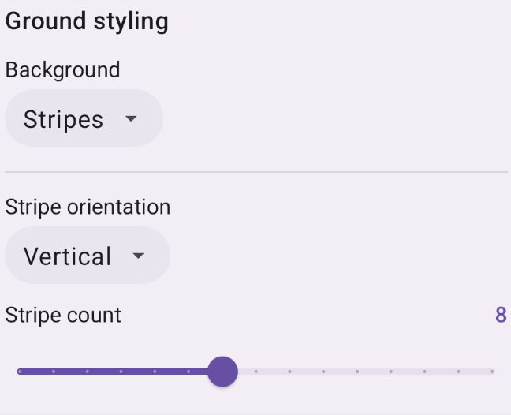
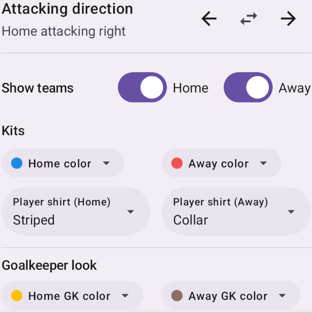
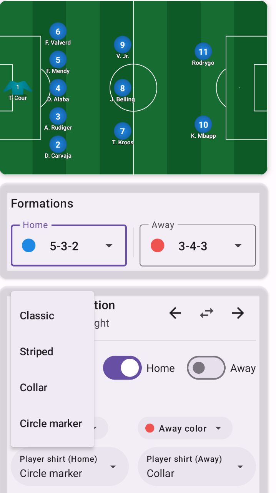
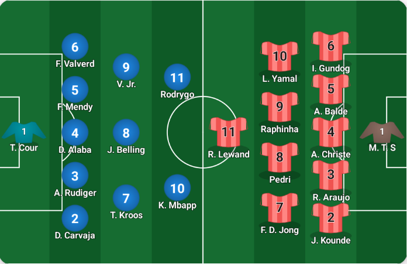
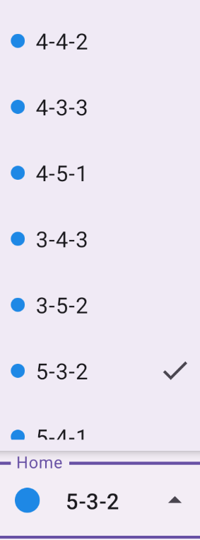
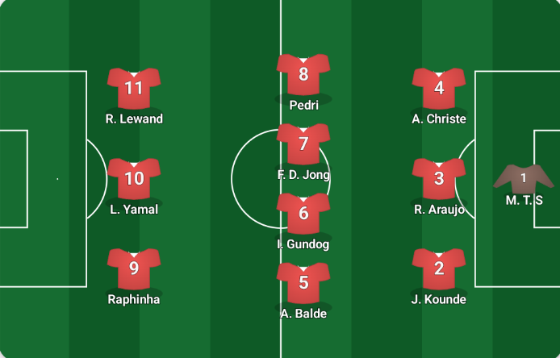

# Compose Football Pitch (Compose Multiplatform)

[](https://github.com/IbrahimAlzaidi/ComposeFootballPitch/actions/workflows/build.yml)
[](https://github.com/IbrahimAlzaidi/ComposeFootballPitch/actions/workflows/code_style.yml)
[](LICENSE.txt)
[](https://kotlinlang.org)
[](https://www.jetbrains.com/lp/compose-multiplatform/)

A Compose Multiplatform library for rendering customizable football (soccer) pitches and team lineups across Android, Desktop, and iOS. Comes with a playground app for experimenting with formations, grass styles, and kit colors.

## Table of contents

- [Preview](#preview)
- [Features](#features)
- [Status & Compatibility](#status--compatibility)
- [Core concepts](#core-concepts)
- [Installation](#installation)
- [Quick start](#quick-start)
- [Module layout](#module-layout)
- [Run the samples](#run-the-samples)
- [Development](#development)
- [Publishing notes](#publishing-notes)
- [Contributing](#contributing)
- [License](#license)

## Preview

<table>
  <tr>
    <td align="center">
      <br/>
      <sub><b>Player shape – classic</b></sub>
    </td>
    <td align="center">
      <br/>
      <sub><b>Pitch – general overview</b></sub>
    </td>
  </tr>
  <tr>
    <td align="center">
      <br/>
      <sub><b>Ground styling</b></sub>
    </td>
    <td align="center">
      <br/>
      <sub><b>What you can change</b></sub>
    </td>
  </tr>
  <tr>
    <td align="center">
      <br/>
      <sub><b>Player shapes on pitch</b></sub>
    </td>
    <td align="center">
      <br/>
      <sub><b>Player shapes set</b></sub>
    </td>
  </tr>
  <tr>
    <td align="center">
      <br/>
      <sub><b>Supported formations</b></sub>
    </td>
    <td align="center">
      <br/>
      <sub><b>Single team layout</b></sub>
    </td>
  </tr>
</table>


## Features
- **Pitch rendering**: FIFA-like proportions, configurable line color/thickness, four orientations (horizontal/vertical, plus reversed).
- **Grass/backgrounds**: solid color, stripes (count, orientation, palette), checkerboard (rows/columns/colors), gradients (direction/colors).
- **Team layout**: formation-driven positions, auto-mirroring for away sides, dual-team overlap avoidance by anchoring to opposite halves/stripe guides.
- **Kits and players**: per-team shirt colors, goalkeeper override, shirt styles (classic, striped, collar, goalkeeper long sleeves, circle markers), optional player names with configurable font/outline, optional number font family.
- **Names and labels**: opt-in name rendering via `PitchStyle.playerNameStyle` with abbreviations (initials + 12-char cap) for consistent widths.
- **API surface**: simple models (`MatchTeams`, `TeamSetup`, `Formation`, `PitchStyle`) and composable `FootballPitch`.
- **Multiplatform**: one Compose API usable on Android, Desktop, and iOS.

## Status & Compatibility

- **Status**: Experimental / Beta (API may change).
- **Kotlin**: 1.9.21
- **Compose Multiplatform**: 1.5.11
- **Targets**:
  - ✅ Android (JitPack artifact)
  - ✅ Desktop (JVM)
  - ⚠️ iOS: supported via source/local build today; JitPack artifact is JVM-only. KMP/iOS artifacts will follow when published to a multiplatform-friendly repo.
- **Android**: Works with your app’s `minSdk`/`targetSdk` (library is pure Compose with no platform stubs).

## Core concepts

| Type            | Purpose                                                  |
|-----------------|----------------------------------------------------------|
| `FootballPitch` | Main composable that renders the pitch + teams           |
| `MatchTeams`    | High-level match setup (home/away + formations + kits)   |
| `TeamSetup`     | One team’s formation, colors, name, and kit style        |
| `TeamLineup`    | Resolved player positions used internally for rendering  |
| `PitchStyle`    | Visual configuration: grass, lines, fonts, names, etc.   |
| `TeamKitStyle`  | Shirt styles for field players and goalkeeper            |
| `Formation`     | Predefined and custom formations (4-4-2, 3-4-3, etc.)    |

## Installation
Using JitPack (tags such as `v1.0.0`):

```kotlin
repositories {
    maven { url = uri("https://jitpack.io") }
}
dependencies {
    implementation("com.github.IbrahimAlzaidi:ComposeFootballPitch:1.1.0")
}
```

## Quick start
```kotlin
import footballpitch.FootballPitch
import footballpitch.model.*

@Composable
fun MatchScreen() {
    // Colors are ARGB hex: 0xAARRGGBB (FF = fully opaque)
    val homeBlue = Color(0xFF1E88E5)
    val homeKeeperAmber = Color(0xFFFFC107)
    val awayRed = Color(0xFFEF5350)
    val awayKeeperBrown = Color(0xFF8D6E63)
    val grassDark = Color(0xFF166C31)
    val grassDarker = Color(0xFF0E5A26)

    val matchTeams =
        MatchTeams(
            home =
                TeamSetup(
                    name = "Real Madrid",
                    colorArgb = homeBlue.value.toLong(),
                    goalkeeperColorArgb = homeKeeperAmber.value.toLong(),
                    formation = Formations.fourFourTwo(),
                    kitStyle =
                        TeamKitStyle(
                            fieldPlayerShirtStyle = ShirtStyle.STRIPED,
                            goalkeeperShirtStyle = ShirtStyle.GOALKEEPER,
                        ),
                ),
            away =
                TeamSetup(
                    name = "Barcelona",
                    colorArgb = awayRed.value.toLong(),
                    goalkeeperColorArgb = awayKeeperBrown.value.toLong(),
                    formation = Formations.threeFourThree(),
                    kitStyle =
                        TeamKitStyle(
                            fieldPlayerShirtStyle = ShirtStyle.COLLAR,
                            goalkeeperShirtStyle = ShirtStyle.GOALKEEPER,
                        ),
                ),
        )

    val (homeLineup, awayLineup) = matchTeams.toLineups()

    FootballPitch(
        orientation = PitchOrientation.Horizontal,
        style =
            PitchStyle(
                background =
                    PitchBackground.Gradient(
                        colors = listOf(grassDark, grassDarker),
                    ),
                playerNameStyle = PlayerNameStyle(), // remove if you don't want names drawn
            ),
        homeTeam = homeLineup,
        awayTeam = awayLineup,
    )
}
```

## Module layout
- `ComposeFootballPitch` — the KMP library.
- `sample/shared` — shared Compose code for the sample apps.
- `sample/androidApp` — Android playground wired to the latest UI.
- `sample/desktopApp` and `sample/iosApp` — platform shells (wire as needed).

## Run the samples
- Android: `./gradlew :sample:androidApp:assembleDebug`
- Desktop: `./gradlew :sample:desktopApp:run`

## Development
- Library sources: `ComposeFootballPitch/src/commonMain/kotlin/footballpitch`
- Rendering internals: `ComposeFootballPitch/src/commonMain/kotlin/footballpitch/rendering`
- Tests: `ComposeFootballPitch/src/commonTest`

Useful tasks:
```bash
./gradlew :ComposeFootballPitch:check
./gradlew ktlintCheck
```

## Publishing notes
Gradle coordinates are set to JitPack style: `com.github.IbrahimAlzaidi:ComposeFootballPitch:1.1.0`.

## Contributing

Contributions are welcome!

- Bug reports and feature requests: please use [GitHub Issues](./issues).
- For code changes:
  1. Fork the repo
  2. Create a branch: `feature/my-idea`
  3. Run `./gradlew :ComposeFootballPitch:check ktlintCheck`
  4. Open a pull request

## License
Apache 2.0. See `LICENSE.txt`.
